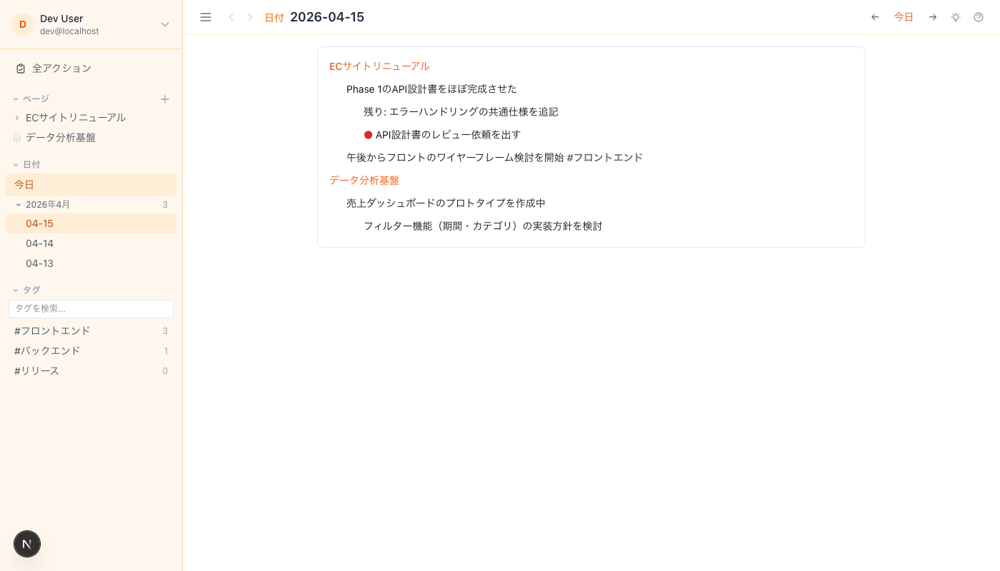
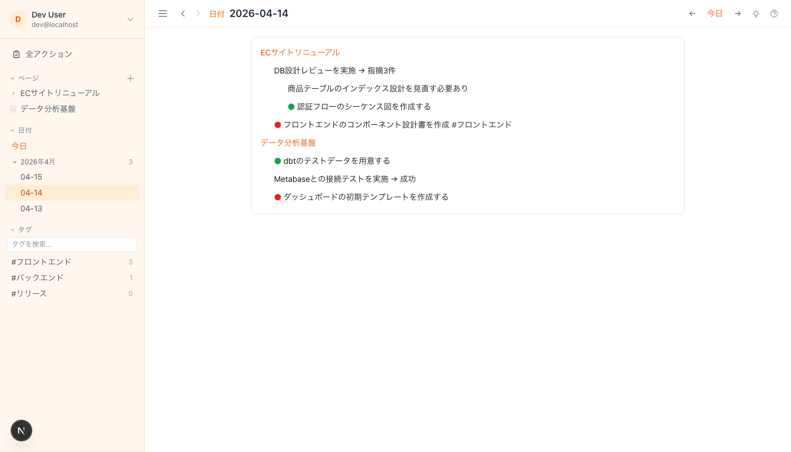
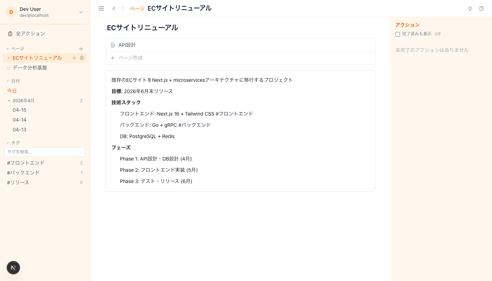
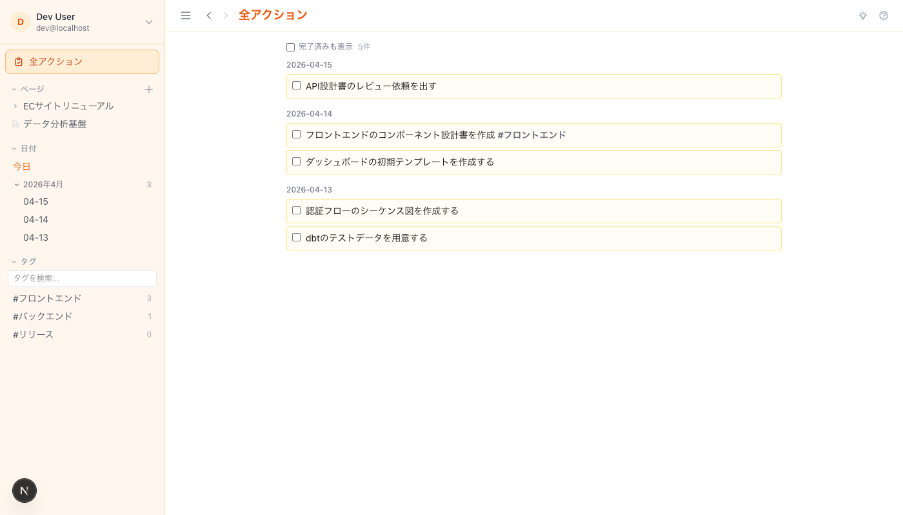

<p align="center">
  
</p>

<h1 align="center">history-md</h1>

<p align="center">
  <strong>Logseq inspired, browser-first. A lightweight, self-hostable note-taking app.</strong><br>
  Markdown / block editor / backlinks / tags / actions / AI -- all in the browser.
</p>

<p align="center">
  <a href="https://github.com/KoichiIshiguro/history_by_md/blob/main/LICENSE"></a>
  
  
  
  
</p>

---

## What is history-md?

Logseq and Obsidian are powerful, but heavy. Notion is cloud-only.
**history-md** is a lightweight, self-hostable alternative that runs entirely in the browser.

**Daily journal + Project pages** -- two axes of the same data. Write daily logs with project mentions, and the project page automatically aggregates all related entries and tasks. Switch perspectives freely between date-based and project-based views to manage your work.

### Daily Journal View

Write daily logs, mention projects with `{{page}}`, and track tasks with `!action` / `!done`.



Past entries with completed and pending actions across multiple projects:



### Project Page View

Click a project link to see its description, tech stack, and all referenced entries. Actions created in daily journals appear here as well, giving a unified project view.



### Action Tracking

The "All Actions" view aggregates every `!action` across all dates and projects. Check them off as you complete them.



## Key Workflow

1. **Create project pages** -- Define projects, write descriptions, tech stacks, phases
2. **Write daily journals** -- Mention projects with `{{project name}}`, log progress, create tasks with `!action`
3. **Switch perspectives** -- View by date (what did I do today?) or by project (what's the status?)
4. **Track actions** -- `!action` creates a task (red), `!done` marks it complete (green). The Actions view shows all pending tasks

## Features

| Feature | Description |
|---------|-------------|
| Block Editor | Logseq-style outliner with indent/outdent, Undo/Redo (Ctrl+Z), multi-select |
| Markdown | GFM tables, code blocks, Mermaid diagrams, task lists, strikethrough |
| Pages | Hierarchical pages with parent/child nesting, full-path links `{{parent/child}}` |
| Tags | `#tag` auto-detection, tag view groups blocks by source page |
| Backlinks | Bidirectional references between pages and dates |
| Actions | `!action` (red) / `!done` (green) flags, filterable action list |
| Templates | Create reusable block templates, insert with `!template` or `!t` |
| AI Generation | `!ai <prompt>` inline AI text generation powered by Gemini |
| AI Chat (RAG) | Semantic search over your notes with context-aware chat |
| Multi-select | Shift+click range select, Delete, Ctrl+C/X/V for bulk operations |
| Themes | Orange, Blue, Purple, Green, Pink -- persisted in localStorage |
| Mobile | Responsive sidebar, swipe gestures, PWA installable |
| Auth | Google OAuth (NextAuth.js), multi-user with admin panel |

## Quick Start

```bash
# Clone
git clone https://github.com/KoichiIshiguro/history_by_md.git
cd history_by_md

# Install
npm install

# Set up environment
cp .env.example .env.local
# Edit .env.local with your credentials (see below)

# Run
npm run dev
```

Open [http://localhost:3000](http://localhost:3000)

### Environment Variables

Create a `.env.local` file:

```env
# Required: Authentication
GOOGLE_CLIENT_ID=your-google-client-id
GOOGLE_CLIENT_SECRET=your-google-client-secret
NEXTAUTH_SECRET=your-random-secret-string
NEXTAUTH_URL=http://localhost:3000

# Optional: AI features (require separate API keys)
GEMINI_API_KEY=your-google-gemini-api-key        # For !ai generation and AI chat
VOYAGE_API_KEY=your-voyage-ai-api-key             # For vector embeddings (RAG)
PINECONE_API_KEY=your-pinecone-api-key            # For vector storage (RAG)
PINECONE_INDEX=your-pinecone-index-name           # Default: history-md
```

> **Note:** AI features (`!ai` generation, AI chat, vector sync) require separate API keys from [Google AI Studio](https://aistudio.google.com/), [Voyage AI](https://www.voyageai.com/), and [Pinecone](https://www.pinecone.io/). The app works fully without these keys -- AI features are simply disabled.

## Tech Stack

| Layer | Technology |
|-------|-----------|
| Framework | [Next.js 16](https://nextjs.org/) (App Router) |
| UI | [React 19](https://react.dev/) + [Tailwind CSS v4](https://tailwindcss.com/) |
| Database | [SQLite](https://www.sqlite.org/) via [better-sqlite3](https://github.com/WiseLibs/better-sqlite3) |
| Auth | [NextAuth.js v5](https://authjs.dev/) (Google OAuth) |
| Markdown | [react-markdown](https://github.com/remarkjs/react-markdown) + remark-gfm + rehype-raw |
| Diagrams | [Mermaid](https://mermaid.js.org/) (CDN loaded) |
| AI | [Gemini 2.5 Flash](https://ai.google.dev/) + [Voyage AI](https://www.voyageai.com/) + [Pinecone](https://www.pinecone.io/) |
| PWA | Service Worker + Web App Manifest |

## Deploy

### VPS / Self-hosted

```bash
npm run build
npm start
```

SQLite database is stored at `./data/app.db`.

### Docker (Coming Soon)

## Roadmap

- [ ] Docker image for one-command self-hosting
- [ ] Graph view (page relationship visualization)
- [ ] Full-text search
- [ ] Import/Export (Markdown files, Logseq format)
- [ ] API for external integrations
- [ ] Collaboration (real-time editing)
- [ ] Plugin system

## Contributing

Contributions are welcome! Please feel free to submit a Pull Request.

1. Fork the repository
2. Create your feature branch (`git checkout -b feature/amazing-feature`)
3. Commit your changes (`git commit -m 'Add amazing feature'`)
4. Push to the branch (`git push origin feature/amazing-feature`)
5. Open a Pull Request

## License

[MIT](LICENSE) - Use it however you want.

## Author

**Koichi Ishiguro** - [@KoichiIshiguro](https://github.com/KoichiIshiguro)

---

<p align="center">
  If you find this useful, please give it a star!
</p>
